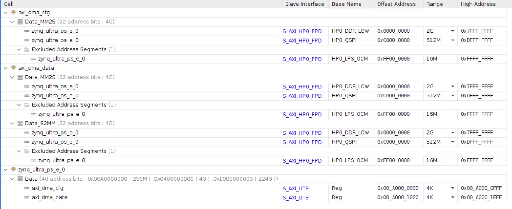

# ac^2SLAM
## License
ac^2SLAM is released under a GPLv3 license.
If you use ac^2SLAM in an academic work, please cite the publication.
```
@INPROCEEDINGS{9609808,
  author={Wang, Cheng and Liu, Yingkun and Zuo, Kedai and Tong, Jianming and Ding, Yan and Ren, Pengju},
  booktitle={2021 International Conference on Field-Programmable Technology (ICFPT)}, 
  title={ac<sup>2</sup>SLAM: FPGA Accelerated High-Accuracy SLAM with Heapsort and Parallel Keypoint Extractor}, 
  year={2021},
  volume={},
  number={},
  pages={1-9},
  doi={10.1109/ICFPT52863.2021.9609808}}
```
## DOI
https://doi.org/10.5281/zenodo.5735556
## Introduction
Simultaneous Localization and Mapping (SLAM) is the algorithm for constructing a map and keeping tracking robot localization in unknown surroundings, which is critical for acting as the necessary underlying component to support high-level applications, like navigation and multi-agent collaboration.
When it comes to deployment on autonomous mobile robots, constrained by the stringent power budget and physical size, the compute power on embedded devices is insufficient to serve the SLAM algorithms in real-time.

This project includes a complete acceleration scheme based on the ORB-SLAM2 algorithm, called acSLAM, including both front-end and back-end.

## Architecture Overview
### System
We implement ORB extractor and heapsort as specialized hardware modules, and combine with the CPU to realize a heterogeneous end-to-end system for ORB-SLAM2. The overall workflow of the system is shown below:


## Contents of each folder
### HW
The source files of hardware
### SW
Notebook run in Jupyter Notebook and source files of ORB-SLAM2
### Vivado
Script for constructing Vivado Block Design

## Results on ZCU104 Board
### 1.Resource Utilizaton
|     | Utilization  | Available | Utilization % |
|  ----  | ----  | ----  | ----  |
| CLB LUTs  | 174737 | 230400 | 75.84 |
| FF  | 93306 | 460800 | 20.25 |
| BRAM  | 285 | 312 | 91.35 |
| URAM  | 6 | 96 | 6.25 |
| DSP  | 180 | 1728 | 10.42 |

 The latency of feature extraction in 4-level image pyramid for TUM and 8-level image pyramid for KITTI is shown below:
 |     | TUM(640×480)  | KITTI(1241×376) |
|  ----  | ----  | ----  |
| latency  | 2.0ms | 5.1ms |

 
Compared with running ORB-SLAM2 on  the ARM processor, acSLAM achieves 2.1× and 2.7× faster in the TUM and KITTI datasets, while maintaining 10% error of SOTA eSLAM. In addition, the FPGA accelerated front-end achieves 4.55× and 40× faster than eSLAM and ARM. 

## Steps to Rebuild Project

### Prerequiste

• Vivado® Design Suite 2019.1

• Board: ZCU104

• System on Board: PYNQ Linux v2.5 running Linux 4.19.0-xilinx-v2019.1, based on Ubuntu 18.04


• Pangolin, OpenCV, Eigen3

### Step1. Rebuild ip in ```<path-to-proj>/HW```

Open Vivado HLS 2019.1 command terminal and run these commands :

```
cd <path-to-proj>/HW/hls

cd resize
vivado_hls -f script.tcl

cd ..

cd FAST_extractor
vivado_hls -f script.tcl

cd ..

cd RS_BRIEF
vivado_hls -f script.tcl
```

### Step2. Rebuild Vivado Project in ```<path-to-proj>/Vivado```

Open Vivado 2019.1 command terminal and run these commands to rebuild Vivado project:
NOTE:```ORB_extractor_1_bd.tcl``` only use for ZCU104, another script file ```ORB_106.tcl``` use for ZCU106
```
cd <path-to-proj>/Vivado
source ./ORB_extractor_1_bd.tcl # for ZCU104
# source ./ORB_106.tcl # for ZCU106
```
The script will generate a project with a block design. Then please create the hdl wrapper and generate the bitstream in vivado.
```
make_wrapper -files [get_files <path-to-proj>/Vivado/myproj/project_1.srcs/sources_1/bd/ORB_extractor_1/ORB_extractor_1.bd] -top
add_files -norecurse <path-to-proj>/Vivado/myproj/project_1.srcs/sources_1/bd/ORB_extractor_1/hdl/ORB_extractor_1_wrapper.v
launch_runs impl_1 -to_step write_bitstream -jobs 48
```

### Step3. Overlay the bitstream in ```<path-to-proj>/SW```

Run code in ```<path-to-proj>/SW/jupyter_notebooks/ORB/ORB.ipynb``` to overlay the bitstream and test the hardware.

Or 
```bash
source  /etc/profile.d/pynq_venv.sh
sudo -E python LoadBitstream.py SW/jupyter_notebooks/ORB/ORB_106.xsa
```

### Step4. Rebuild ORB_SLAM2_FPGA in ```<path-to-proj>/SW```
> Before rebuilding ORB-SLAM_FPGA, you need to make sure that the **axi_dma_data** and **axi_dma_cfg** addresses in ```<path-to-proj>/SW/ORB_SLAM2_FPGA/src/ORBexeractor.cc``` remain the same as those in vivado. 
> 
>>  ORBexeractor.cc:1118-1120 
>> ```cpp
>> uint32_t* mapped_dma_cfg_base = reinterpret_cast<uint32_t*>(cma_mmap(0xA0000000, sizeof(uint32_t)*24));
>> uint32_t* mapped_dma_data_base = reinterpret_cast<uint32_t*>(cma_mmap(0xA0001000, sizeof(uint32_t)*24)); 
>> ```
```
cd <path-to-proj>/SW/ORB_SLAM2_FPGA
sudo chmod +x build.sh
./build.sh
```
TUM example:
```
sudo -E ./Examples/RGB-D/rgbd_tum Vocabulary/RSBvoc.txt Examples/RGB-D/TUMX.yaml PATH_TO_SEQUENCE_FOLDER ASSOCIATIONS_FILE
```
